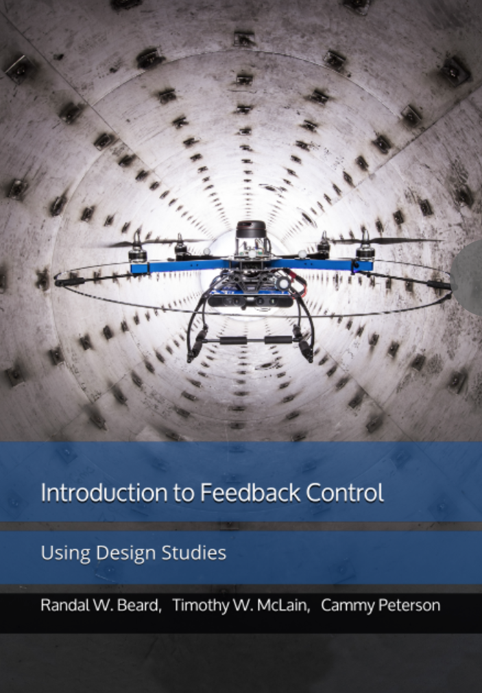

# Introduction to Feedback Control Using Design Studies

[Randal W. Beard](https://ece.byu.edu/directory/randy-beard), 
[Timothy W. McLain](http://me.byu.edu/faculty/timmclain)
[Cammy Peterson](https://ece.byu.edu/directory/cammy-peterson)
[Marc Killpack](https://www.me.byu.edu/directory/marc-killpack)

Hardcopy available on [Amazon](https://www.amazon.com/Introduction-Feedback-Control-Design-Studies/dp/1073396711/ref=sr_1_8?crid=36TN6HXOVZL2J&keywords=introduction+to+feedback+control&qid=1563317351&s=gateway&sprefix=introduction+to+feedba%2Caps%2C158&sr=8-8)

[PDF Version of Book](https://drive.google.com/file/d/1DxioCcBOJl-DoIBkDm8J2_ThItXbGx6e/view?usp=sharing)
    - A PDF version of the book is available at this link.
    - When typos are found, they will be fixed and the most recent version of the book will be posted here.
    - Please send typos and other suggestions to beard@byu.edu.

# LECTURE MATERIAL 
(Under construction) The following lecture materials are included as a resource for instructors.  The slides closely follow the book.  We welcome suggestions on how these slides might be improved.

| Chapter | PDF Slides | Powerpoint | Last Modified |
|---------|------------|------------|----------|
| Chapter 1 - Introduction                  | [chapter1.pdf](https://drive.google.com/file/d/1EEJYRFGhS33oQ6utmfpvlL_AwMsa_qnA/view?usp=sharing)  | [chapter1.pptx](https://docs.google.com/presentation/d/1E64UCiuXwzBCBfGddauZVB_SIuUA60Qf/edit?usp=sharing&ouid=115325376918178448854&rtpof=true&sd=true)  | Sept 2019 |
| Chapter 2 - Kinetic Energy                | [chapter2.pdf](https://drive.google.com/file/d/1Ey-o1F22cvjoc-gGlguOWAAwI1S_JLEC/view?usp=sharing)  | [chapter2.pptx](https://docs.google.com/presentation/d/1ExZBt4HSP8Nq1pJT9_alLNjg4Rqma-ok/edit?usp=sharing&ouid=115325376918178448854&rtpof=true&sd=true)  | Sept 2021 |
| Chapter 3 - Euler Lagrange                | [chapter3.pdf](https://drive.google.com/file/d/1EyYrhTzkqkcdqUtvDrF7Jwe9Sgk1C-wH/view?usp=sharing)  | [chapter3.pptx](https://docs.google.com/presentation/d/1FAJS49tG-3L4GBOjQdPihNfToJ42EOQr/edit?usp=sharing&ouid=115325376918178448854&rtpof=true&sd=true)  | Sept 2021 |
| Equations of Motion + Physics Engine      | [eom.pdf](https://drive.google.com/file/d/19mIpoAhooHJyCG8GymN00wSn-VfiXCQg/view?usp=sharing)  | [eom.pptx](https://docs.google.com/presentation/d/19_ZclPdJI96Fjnhned3-r2ByDcBB70Hd/edit?usp=sharing&ouid=115325376918178448854&rtpof=true&sd=true)  | Jan 2023 |
| Chapter 4 - Linearization                 | [chapter4.pdf](https://drive.google.com/file/d/1F7BPUXK1KO9s7lyXbmucp07YO9DHKcHl/view?usp=sharing)  | [chapter4.pptx](https://docs.google.com/presentation/d/1FD64VFeKZhbFzBC1Uc8AuH-NRQJMivWf/edit?usp=sharing&ouid=115325376918178448854&rtpof=true&sd=true)  | Sept 2021 |
| Chapter 5 - Transfer Function Models      | [chapter5.pdf](https://drive.google.com/file/d/1Er4SM3FTgFibvc0HSsgzES2N8pPXGFiG/view?usp=sharing)  | [chapter5.pptx](https://docs.google.com/presentation/d/1EngIns0Yo4-K2jL7vCNXFfuNH3YyhOx9/edit?usp=sharing&ouid=115325376918178448854&rtpof=true&sd=true)  | Jan 2023 |
| Chapter 6 - State Space Models            | [chapter6.pdf]()  | [chapter6.pptx]()  |  |
| Chapter 7 - Second Order Systems          | [chapter7.pdf]()  | [chapter7.pptx]()  |  |
| Chapter 8 - Second Order Design           | [chapter8.pdf]()  | [chapter8.pptx]()  |  |
| Chapter 9 - Integrators                   | [chapter9.pdf]()  | [chapter9.pptx]()  |  |
| Chapter 10 - Digital PID                  | [chapter10.pdf]() | [chapter10.pptx]() |  |
| Chapter 11 - Full State Feedback          | [chapter11.pdf]() | [chapter11.pptx]() |  |
| Chapter 12 - Full State with Integrators  | [chapter12.pdf]() | [chapter12.pptx]() |  |
| Chapter 13 - Observers                    | [chapter13.pdf]() | [chapter13.pptx]() |  |
| Chapter 14 - Disturbance Observers        | [chapter14.pdf]() | [chapter14.pptx]() |  |
| Chapter 15 - Frequency Response           | [chapter15.pdf](https://drive.google.com/file/d/1EfjgR3Tijt5eJG9_ZFZc6v76ggy6iF6H/view?usp=sharing) | [chapter15.pptx](https://docs.google.com/presentation/d/1EeHZRrOXjGOTIN6TB_irWqs0YIlUc446/edit?usp=sharing&ouid=115325376918178448854&rtpof=true&sd=true) | Nov 2021  |
| Chapter 16 - Frequency Specifications     | [chapter16.pdf](https://drive.google.com/file/d/1EbImcppDqorO7fxp4Tn93zJfX9J23sGP/view?usp=sharing) | [chapter16.pptx](https://docs.google.com/presentation/d/1E_spVCx6YU-OHUQY4QAqBG2nLR6G_rgR/edit?usp=sharing&ouid=115325376918178448854&rtpof=true&sd=true) | Nov 2021  |
| Chapter 17 - Robustness Margins           | [chapter17.pdf](https://drive.google.com/file/d/1EOx9_QtNbere-bT1zuSy8or5f4SPR57C/view?usp=sharing) | [chapter17.pptx](https://docs.google.com/presentation/d/1ENBydG22LrYo_jAXgsT7P20unb50yNVK/edit?usp=sharing&ouid=115325376918178448854&rtpof=true&sd=true) | Nov 2021 |
| Chapter 18 - Compensator Design           | [chapter18.pdf](https://drive.google.com/file/d/1EMXKKlGUF-OCkaB1ffKkopsRwKZjPI7i/view?usp=sharing) | [chapter18.pptx](https://docs.google.com/presentation/d/1EF8tgs-kEVPWVJt7G7b3sa-eP1eNIGmJ/edit?usp=sharing&ouid=115325376918178448854&rtpof=true&sd=true) | Nov 2021 |

# Jupyter Notebooks

The Jupyter notebooks in this repository were developed by Dr. Robert Leishman at Air Force Institute of Technology.

They are designed to be run in google colab.

# Homework Solutions

This Gitlab account contains complete python, matlab, and simulink solutions to the three design problems presented in the book.  We will be actively maintaining the Python solutions.

## Prerequisites

You will need to install a version of python 3 on your computer.  Download the latest version of python from 
[https://www.python.org](https://www.python.org).

You will also want to install an IDE.  We recommend either:
- [PyCharm](https://www.jetbrains.com/pycharm/) or
- [VS Code](https://code.visualstudio.com)

## Python packages
Install the following python packages:
- numpy
- slipy
- matplotlib
- control
- pyqtgraph
- pyqt6

In linux or macos, you can install a python package using the command

pip3 install numpy

If you are using pycharm, open Settings>Project:python>Python Interpreter.  Make sure that the latest python interpreter is selected at the top, and then click "+" do add a package and search for the needed package.  For example, my system is set up as shown below.

# Hummingbird Lab
[PDF Lab Manual](https://drive.google.com/file/d/1DzFGTip7jdT5Q33OeuZrK28yvU95lOPe/view?usp=sharing)

## Whirlybird_ws
Whirlybird_ws
The whirlybird workspace is the catkin workspace used to connect to the Whirlybirds via ROS. The Whirlybird workspace provided includes the necessary files to operate the whirlybird and also includes templates for lab assignments. It is necessary to clone this repository in order to complete the labs.

The whirlybird_ws directory is large and complex, but you will only need to modify the files in the sub-directories whirlbyird_controller and whirlybird_sim. These are contained in the directory 

whirlybird_ws/src/

The repository is hosted on BYU [MAGICC Lab's Gitlab server](https://gitlab.magiccvs.byu.edu/whirlybird/whirlybird_ws?). The README explains how to configure the workspace.

## Support Files
The support files are used to help rendering simulation in python easier. Read the comments in each file to see how to use it, or look in the Whirlbird Manual to see how the files are implemented.
    - [Slider Input](https://drive.google.com/file/d/1GpNxenJV3nRUAQEmlEXJT7mhDP6qWJIw/view?usp=sharing)
    - [Signal Generator](https://drive.google.com/file/d/1GoiYxUun2PyLZPWDcPSxUR35Bb80nRjJ/view?usp=sharing)
    - [Simulation Plot](https://drive.google.com/file/d/1H2d8O5XlL7YMymf5HlUM6lvGfenWT5xf/view?usp=sharing)
    - [PD Controller](https://drive.google.com/file/d/1GjIG1b3lM-ewPDqSEFot__S0sEUMEbEp/view?usp=sharing)
    - [Step Function](https://drive.google.com/file/d/1GUrNX2Sio_NO5muddL8Wf_CiotXo9Wkv/view?usp=sharing)

## ROS Tutorial
For Students that would like to learn ROS more thoroughly, we have provided the following references to excellent ROS tutorials.
    - [Official ROS Tutorials](http://wiki.ros.org/ROS/Tutorials)
    - [A Gentile Introduction of ROS by Jason M O'Kane](https://cse.sc.edu/~jokane/agitr/)
    - [Magicc Lab ROS Tutorials](https://wiki.magiccvs.byu.edu/#!ros_tutorials/intro.md)
