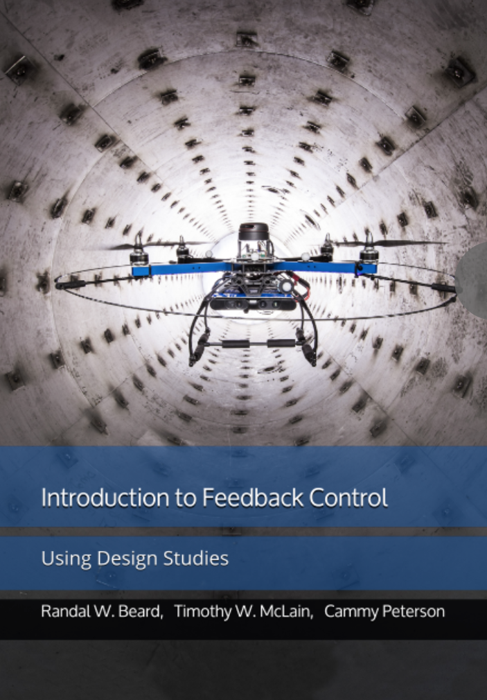

# Introduction to Feedback Control Using Design Studies



[Randal W. Beard](https://ece.byu.edu/directory/randy-beard), 
[Timothy W. McLain](http://me.byu.edu/faculty/timmclain)
[Cammy Peterson](https://ece.byu.edu/directory/cammy-peterson)
[Marc Killpack](https://www.me.byu.edu/directory/marc-killpack)
[James Usevitch](https://ece.byu.edu/directory/james-usevitch)

Hardcopy available on [Amazon](https://www.amazon.com/Introduction-Feedback-Control-Design-Studies/dp/1073396711/ref=sr_1_8?crid=36TN6HXOVZL2J&keywords=introduction+to+feedback+control&qid=1563317351&s=gateway&sprefix=introduction+to+feedba%2Caps%2C158&sr=8-8)

[PDF Version of Book](https://drive.google.com/file/d/1OH6oSsbbdsxkY2CTMMxnchkWnNy_16zy/view?usp=sharing)
    - A PDF version of the book is available at this link.
    - When typos are found, they will be fixed and the most recent version of the book will be posted here.
    - Please send typos and other suggestions to beard@byu.edu.

[Interactive Textbook](https://byu-controlbook.github.io/controlbook_public/interactive/)
    - An interactive HTML version of the textbook is available at this link.


# LECTURE MATERIAL 
(Under construction) The following lecture materials are included as a resource for instructors.  The slides closely follow the book.  We welcome suggestions on how these slides might be improved.

| Chapter | PDF Slides | Powerpoint | Last Modified |
|---------|------------|------------|----------|
| Chapter 1 - Introduction                  | [chapter1.pdf](https://drive.google.com/file/d/1EEJYRFGhS33oQ6utmfpvlL_AwMsa_qnA/view?usp=sharing)  | [chapter1.pptx](https://docs.google.com/presentation/d/1E64UCiuXwzBCBfGddauZVB_SIuUA60Qf/edit?usp=sharing&ouid=115325376918178448854&rtpof=true&sd=true)  | Sept 2019 |
| Chapter 2 - Kinetic Energy                | [chapter2.pdf](https://drive.google.com/file/d/1Ey-o1F22cvjoc-gGlguOWAAwI1S_JLEC/view?usp=sharing)  | [chapter2.pptx](https://docs.google.com/presentation/d/1ExZBt4HSP8Nq1pJT9_alLNjg4Rqma-ok/edit?usp=sharing&ouid=115325376918178448854&rtpof=true&sd=true)  | Sept 2021 |
| Chapter 3 - Euler Lagrange                | [chapter3.pdf](https://drive.google.com/file/d/1EyYrhTzkqkcdqUtvDrF7Jwe9Sgk1C-wH/view?usp=sharing)  | [chapter3.pptx](https://docs.google.com/presentation/d/1FAJS49tG-3L4GBOjQdPihNfToJ42EOQr/edit?usp=sharing&ouid=115325376918178448854&rtpof=true&sd=true)  | Sept 2021 |
| Chapter 4 - Linearization                 | [chapter4.pdf](https://drive.google.com/file/d/1F7BPUXK1KO9s7lyXbmucp07YO9DHKcHl/view?usp=sharing)  | [chapter4.pptx](https://docs.google.com/presentation/d/1FD64VFeKZhbFzBC1Uc8AuH-NRQJMivWf/edit?usp=sharing&ouid=115325376918178448854&rtpof=true&sd=true)  | Sept 2021 |
| Chapter 5 - Transfer Function Models      | [chapter5.pdf](https://drive.google.com/file/d/1Er4SM3FTgFibvc0HSsgzES2N8pPXGFiG/view?usp=sharing)  | [chapter5.pptx](https://docs.google.com/presentation/d/1EngIns0Yo4-K2jL7vCNXFfuNH3YyhOx9/edit?usp=sharing&ouid=115325376918178448854&rtpof=true&sd=true)  | Jan 2023 |
| Chapter 6 - State Space Models            | [chapter6.pdf](https://drive.google.com/file/d/1qr_P4s65w9PvPU8GiBhgGGHoBGeE0ZWd/view?usp=sharing)  | [chapter6.pptx](https://docs.google.com/presentation/d/1AI8FVqTYM8W1slYB6TLXmVs0Ih1o7BLq/edit?usp=sharing&ouid=115325376918178448854&rtpof=true&sd=true)  | Jan 2023 |
| Chapter 7 - Second Order Systems          | [chapter7.pdf](https://drive.google.com/file/d/1AKxaAxtgJps_CaCiwF3VseUzWk15Omo6/view?usp=sharing)  | [chapter7.pptx](https://docs.google.com/presentation/d/1qa7zVWeXmlwrV7rSMSs3gUZ01fEqKUUr/edit?usp=sharing&ouid=115325376918178448854&rtpof=true&sd=true)  | Jan 2023 |
| Chapter 8 - Second Order Design           | [chapter8.pdf](https://drive.google.com/file/d/1r9kbpxmI_UinmSa4cV2MQtXk3uWdb29l/view?usp=sharing)  | [chapter8.pptx](https://docs.google.com/presentation/d/1AQSjAgWB67AWLuEF-j9jAQA4T2-uorxg/edit?usp=sharing&ouid=115325376918178448854&rtpof=true&sd=true)  | Jan 2023 |
| Chapter 9 - Integrators                   | [chapter9.pdf](https://drive.google.com/file/d/1rS9nYeiaxyOx-9L0e7a0JWNOBxlurVRE/view?usp=sharing)  | [chapter9.pptx](https://docs.google.com/presentation/d/1AiYayPKykU5U4BMv4uaPOSIg2SlJwsy3/edit?usp=sharing&ouid=115325376918178448854&rtpof=true&sd=true)  | Feb 2023 |
| Chapter 10 - Digital PID                  | [chapter10.pdf](https://drive.google.com/file/d/1CID0y97BZ6E0cXBWePNukyrb_0N5SNEo/view?usp=sharing) | [chapter10.pptx](https://docs.google.com/presentation/d/1AnKnWk66TnoEEDYMEfZL09p80aClkAkf/edit?usp=sharing&ouid=115325376918178448854&rtpof=true&sd=true) | Feb 2023 |
| Chapter 11 - Full State Feedback          | [chapter11.pdf](https://drive.google.com/file/d/1Csp3LXY05gIoLfYm9mgoaymkxhmpym-B/view?usp=sharing) | [chapter11.pptx](https://docs.google.com/presentation/d/1AuNDqVu5iBQTcgbsFNmc2hSVhfD6FzlK/edit?usp=sharing&ouid=115325376918178448854&rtpof=true&sd=true) | Feb 2023 |
| Chapter 12 - Full State with Integrators  | [chapter12.pdf](https://drive.google.com/file/d/1rvdZhbcHh7i2CcaBEqjuEAuHgONtsTRO/view?usp=sharing) | [chapter12.pptx](https://docs.google.com/presentation/d/1CUn6asTP45NhT5_JW6eF_op24O2GqKd5/edit?usp=sharing&ouid=115325376918178448854&rtpof=true&sd=true) | Feb 2023 |
| Chapter 13 - Observers                    | [chapter13.pdf](https://drive.google.com/file/d/1sOjzTXPo0zfbxdvdHDIgS-5E3v_qhsyg/view?usp=sharing) | [chapter13.pptx](https://docs.google.com/presentation/d/1CWTMmdqLHRhtbOUH0nlduXQinkz1gBDJ/edit?usp=sharing&ouid=115325376918178448854&rtpof=true&sd=true) | March 2023 |
| Chapter 14 - Disturbance Observers        | [chapter14.pdf](https://drive.google.com/file/d/1smHySMt1tTIt-CqEgySUB7IGDs8Los92/view?usp=sharing) | [chapter14.pptx](https://docs.google.com/presentation/d/1CWz7Yqh6puNgxAqCdFba5TRp0HHB6tUL/edit?usp=sharing&ouid=115325376918178448854&rtpof=true&sd=true) | March 2023 |
| Chapter 15 - Frequency Response           | [chapter15.pdf](https://drive.google.com/file/d/1EfjgR3Tijt5eJG9_ZFZc6v76ggy6iF6H/view?usp=sharing) | [chapter15.pptx](https://docs.google.com/presentation/d/1EeHZRrOXjGOTIN6TB_irWqs0YIlUc446/edit?usp=sharing&ouid=115325376918178448854&rtpof=true&sd=true) | March 2023  |
| Chapter 16 - Frequency Specifications     | [chapter16.pdf](https://drive.google.com/file/d/1EbImcppDqorO7fxp4Tn93zJfX9J23sGP/view?usp=sharing) | [chapter16.pptx](https://docs.google.com/presentation/d/1E_spVCx6YU-OHUQY4QAqBG2nLR6G_rgR/edit?usp=sharing&ouid=115325376918178448854&rtpof=true&sd=true) | March 2023  |
| Chapter 17 - Robustness Margins           | [chapter17.pdf](https://drive.google.com/file/d/1EOx9_QtNbere-bT1zuSy8or5f4SPR57C/view?usp=sharing) | [chapter17.pptx](https://docs.google.com/presentation/d/1ENBydG22LrYo_jAXgsT7P20unb50yNVK/edit?usp=sharing&ouid=115325376918178448854&rtpof=true&sd=true) | April 2023 |
| Chapter 18 - Compensator Design           | [chapter18.pdf](https://drive.google.com/file/d/1EMXKKlGUF-OCkaB1ffKkopsRwKZjPI7i/view?usp=sharing) | [chapter18.pptx](https://docs.google.com/presentation/d/1EF8tgs-kEVPWVJt7G7b3sa-eP1eNIGmJ/edit?usp=sharing&ouid=115325376918178448854&rtpof=true&sd=true) | Nov 2021 |


# Homework Solutions

This GitHub account contains complete Python solutions to the three design problems presented in the book.  We will be actively maintaining the Python solutions.

Matlab and Simulink solutions are also available upon request.

Note that homework solutions may need to be slightly altered to fit the current semester's code. For example, in Winter 2024, the code base was altered so that the ``dataplotter`` function needed to have its reference signals thrown in at the end of the list of declared variables instead of in the middle, as in previous years. 


# Hummingbird Lab
The lab description and assignments are described in the hummingbird lab manual, which can be accessed below.  The manual will be updated as needed. **See the Learning Suite copy if there is a discrepancy.**


[PDF Lab Manual](https://drive.google.com/file/d/1-W2Zm1npRpV0NH1-vQXf0qYudbe9F8Ed/view?usp=sharing)

Template files for the hummingbird simulation are contained in the GitHub directory "_hummingbird_sim."

Template files for the hummingbird hardware lab are contained in the GitHub directory "_hummingbird_lab."

## Prerequisites

You will want to install an IDE.  We recommend either:
- [PyCharm](https://www.jetbrains.com/pycharm/) or
- [VS Code](https://code.visualstudio.com)

If Pycharm is chosen, see [the following link](https://docs.cs.byu.edu/doku.php?id=aquiring-free-jetbrains-student-license) for information on how to get a free JetBrains license through BYU.

See the Controls setup PDF found in this repo (``Setting_Up_Controlbook_Code_and_Python_Environment_for_ME_EN_431___EC_EN_483.pdf``) for how to set everything up. 

> For TAs and teachers: The LateX project folder has also been included for easy editing later.

Note that if PyCharm was downloaded instead of VS Code, the section on downloading VSCode in ``Controls_code_setup.pdf`` can be skipped.

## Python Introduction

See [this link](https://acme.byu.edu/00000179-afb2-d74f-a3ff-bfbb15a50000/pythonessentials-pdf) for a great introduction from BYU ACME's program.

More Python tutorial can be found on [the main ACME website](https://foundations-of-applied-mathematics.github.io/).

## Python packages

> This section can be skipped if you followed Setting_Up_Controlbook_Code_and_Python_Environment_for_ME_EN_431___EC_EN_483.pdf 


The following python packages will need to be installed for this class:
- numpy
- slipy
- matplotlib
- control
- pyqtgraph
- pyqt6
- pyopengl

In linux or macos, you can install a python package using the command

pip3 install _name_of_package_

If you are using Pycharm, the following options are available:

1. Open Settings>Project:python>Python Interpreter.  Make sure that the latest python interpreter is selected at the top, and then click "+" do add a package and search for the needed package.  For example:


2. Alternatively, you may use this requirements file to download all the necessary dependencies.

> To install these dependencies, simply use the command:

> pip3 install -r requirements.txt

> NOTE: Pycharm sets up a virtual environment for you, so if you are using Pycharm, instructions on _venv_ can be skipped.

# Jupyter Notebooks

The Jupyter notebooks in this repository were developed by Dr. Robert Leishman at Air Force Institute of Technology.

They are designed to be run in google colab.

# Final Exam

The Final Exam is a comprehensive coding final.

### Practice Final

A practice final, created by Dr. Beard in Winter 2020 and updated in Winter 2023, is found in this repository.

There is no answer key available to students or TAs for this practice final. 

The final exam is almost exactly like the practice exam and so we hope that giving you a similar exam will help you study for the final. If you can figure out how to do the practice exam, you will do just fine on the final.

# Final Suggestions, Common "Gotchas" and Common Questions

1. **Case Study E:** Once PD control and Full State Feedback are implemented, it will be tempted to think that the reason that the code is breaking is because of tuning gains. Rest assured, even on case study E, that the problem is not with tuning gains. Modifying the gains only tweaks _how_ the system performs, not whether or not it performs at all. 

On that note, if you are having issues with Case Study E (which is the hardest case study to implement in this class), review the answer keys to Chapter 4 and Chapter 6 for all 6 systems and you will realize that _Case Study E is the only Case study to completely implement the following:_

- equilibrium state x<sub>e
- equilibrium force F<sub>e
- feedback linearization (with both of these)

Make sure you know the difference between these 3 terms. 

And again, review the answer keys to chapters 4 and 6.

2. **"If number 1 is true, why _are_ my rise times and zeta values different from the answer key? How did they find those rise times and zetas?"** This is a legitimate question that has baffled many students who have not only used the correct equations to find their starting rise times and omegas, but also took the extra time to not simply assume that ζ (zeta) = 0.707 and ω = 2.2/t<sub>r</sub> . Some answer keys show  ζ = 0.95. 

The short answer? Tuning.

The long answer? After a system is working with the ζ and t<sub>r</sub> values one would naturally assume, based on the problem description, repetitively halving t<sub>r</sub> values will slowly increase the speed at which the system arrives at the reference point, which may be desired in some systems. Additionally, ζ (the variable in charge of dampening power) may be increased somewhat if one desires to make the system arrive at the reference point faster, or simply make the plot look nicer.

Once your system is working, following this process will help you get the tuning paramemters you see in the answer keys.

3. **Mixing Array for Case Study F**: The mixing array for Force and Torque in Case Study F might be slighty off, depending on class branch:
```
unmixing = np.array([[1.0, 1.0], [-d, d]]) # converts fl and fr (LR) to force and torque (FT)
```
where it should be:
```
unmixing = np.array([[1.0, 1.0], [d, -d]]) # converts fl and fr (LR) to force and torque (FT)
```

4. **Dynamics of Mechanical Systems:** Make sure to read the dynamic system correctly! Know which variable is in reference to which. For example, is φ in reference to the Y axis or in reference to θ? How does that change the dynamics?

5. **Sympy and other symbolic solvers**: There are several symbolic solvers in Python such as Sympy that are usually allowed on tests. Learning these libraries can be helpful. See ``_B_pendulum/python/hw03_pendulum_solving_for_state_variable_form.py`` for an example.

6. **Block Diagrams:** We use block diagrams to represent a controls system in terms of its input variables, desired signal (reference), and output variables. Be familiar with both modified and unmodified systems, and how to do the math to solve for the output of the system in any scenario.

7. **Laplace Transformations:** Some may have forgotten from their Differential Equations class how to do Laplace Transformations. Review what they are and how to solve them if you feel you have forgotten them.

8. **Dataplotter helper file:** Different versions of the class use different versions of the dataplotter helper file that creates simulations for each case study. The most recent versions require their ``update`` function to place the ``ref`` variable last, since it has a default value. The answer keys do not reflect this. That's on purpose: aside from the pain of constantly updating answer keys, it has commonly been the job of the student to incorporate the answer key to their own system and homework to see what they could do better. Indeed, some answer keys are in ``pdf`` form instead of ``py`` format to force the student to read code line by line. 

So, if you have ``dataplotter.update`` errors, consider moving the ``ref`` variable to be the last variable. 

9. **Case study similarities:** Case Study A is similar in initial setup to Case Study D. Case Study B is similar in setup to Case Study E. Case Study F is almost like a combination of Case Study D and Case Study E in one system. That being said, each system has different dynamics, linearization properties, and parameter requirements. Make sure you understand each system individually, and that you go beyond simply copy-pasting code from one system to another.

10. **Switching positive and minus signs:** Whether on a test, a homework problem, or a line of code, the most pervasive error may be switching positive and minus signs. Don't be one of those people who makes that mistake!

11. **What is a state?** Different robotics and controls applications have different states. Know what variables belong in the system state for this class, and which do not.

12. **"Why do point masses note have a moment of inertia in this class?"** From Wikipedia [(see link to the article here)](https://en.m.wikipedia.org/wiki/List_of_moments_of_inertia), "Point mass M **at a distance _r_ from the axis of rotation.** ... A point mass **does not have a moment of inertia around its own axis**, but using the parallel axis theorem a moment of inertia around a distant axis of rotation is achieved."

13. **"The book says that for the controllability matrix to be square, the system needs to be single input. It also says that for the observability matrix to be square, the system needs to be single output. We can't do that for a lot of our systems, and so we use _place_ from the control library. We can't use the control library on tests. How would we do that on a test?"** In general, the controllability and observability matrices are not square for MIMO systems. You can still check the rank of the controllability / observability matrices, but you won't be asked to apply Ackermann's formula to a MIMO (Multiple Input, Multiple Output) system. As shown in class, it only applys to SISO (Single Input, Single Output) systems.

14. **"I don't understand what a Lagrangian is and why it is what it is. Can you help me understand?"** Here is a video explaining the history and proof of Lagrangians: https://www.youtube.com/watch?v=Q10_srZ-pbs

15. **"I don't have much background in Python. Am I really able to do this class?"** Yes! You will need to learn different features of ``numpy`` and ``sympy``, among other libraries, but have patience, and you will get this! You've got this!

There is also a ``playground.py`` file included for experimenting with Python code. 

16. **"With all of the homework solution files we get, there are just too many files! How do I organize everything I am trying to put in my ``controlbook`` folder?"** In the past, code for each case study homework was organized into individual folders within the case study's python folder. This was accomplished by something like this to the top of the Python simulation script:
```python
import os, sys
from pathlib import Path
num_directories_up = 1
sys.path.insert(0, os.fspath(Path(__file__).parents[num_directories_up]))  # add parent directory

```


 Then, some complained about the folder structure, and the whole thing was removed. 

 If you want to have a folder structure like that to organize your homework files, feel free to use the above lines of code.
